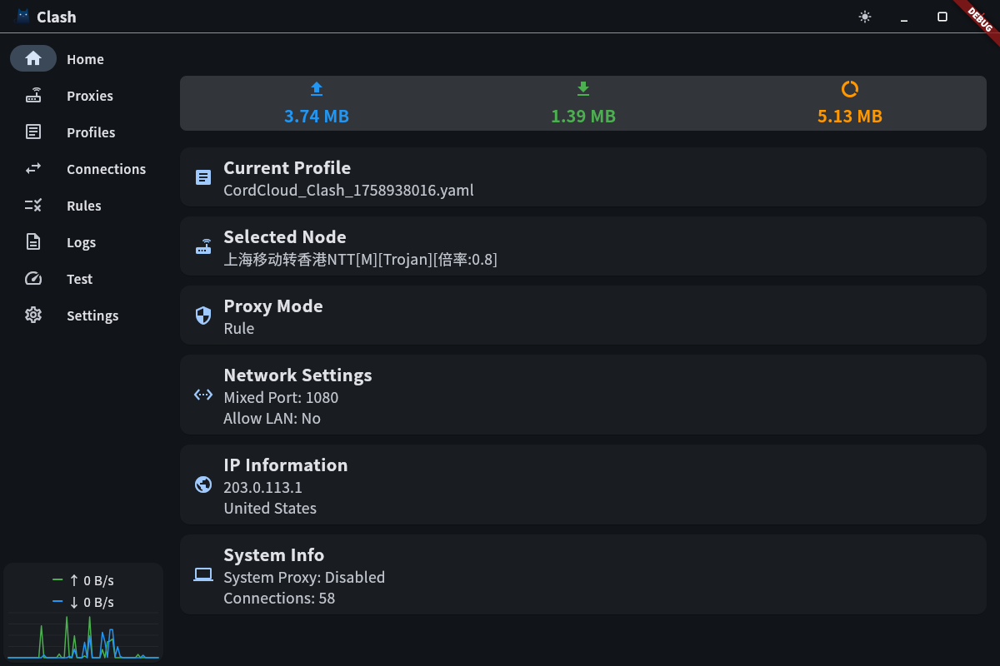

# Clash

A **fully functional** cross-platform Clash proxy tool built with Flutter 🚀




## 🎯 Overview

This is a **production-ready** Clash proxy management tool with actual proxy protocol implementations, similar to clash-verge-rev but built with Flutter for true cross-platform support. Unlike typical Flutter UI demos, this project includes **working proxy protocols** (Trojan, Shadowsocks) with SOCKS5 server support.

**🎉 BREAKING NEWS**: Clash now **works on Android**! The implementation includes a complete VPN service with in-process TUN device packet processing, traffic interception, and proxy forwarding.

## ✨ Key Features

### 🔐 **Working Proxy Protocols**

- ✅ **Trojan Protocol** - Full implementation with SHA224 authentication
- ✅ **Shadowsocks Protocol** - AEAD ciphers (AES-GCM, ChaCha20-Poly1305)
- ✅ **SOCKS5 Server** - Auto-detection, IPv4/IPv6/domain support
- ✅ **HTTP CONNECT** - HTTPS tunneling support
- 🔄 **VMess Protocol** - Planned (FFI integration recommended)

### 📱 **Complete User Interface (8 Pages)**

1. **Home** - Dashboard with traffic monitor and system status
2. **Proxies** - Node management with speed testing and group support
3. **Profiles** - Subscription management with YAML parsing
4. **Connections** - Real-time connection monitoring
5. **Rules** - Routing rules display
6. **Logs** - Application logs with filtering
7. **Test** - Batch proxy speed testing
8. **Settings** - System configuration
9. **Android VPN** - System-wide proxy with in-process TUN processor

### 🚀 **Advanced Capabilities**

- ✅ **Real Proxy Connections** - Connect through Trojan/Shadowsocks servers
- ✅ **YAML Configuration** - Parse and load Clash subscription files
- ✅ **Speed Testing** - TCP latency measurement for all nodes
- ✅ **Password Management** - Secure credential parsing and storage
- ✅ **Proxy Groups** - Support for selector/url-test/fallback groups
- ✅ **Persistent State** - SharedPreferences for configuration persistence
- ✅ **Auto-Reconnect** - Automatically reconnects to last selected proxy on startup
- ✅ **Traffic Monitoring** - Real-time upload/download statistics
- ✅ **Local Proxy Server** - SOCKS5/HTTP on port 1080 (configurable)
- ✅ **Android VPN** - Full VPN integration with in-process TUN processor
- ✅ **Private Rules** - Password-protected rule editing (4-digit PIN)

## 🏗️ Architecture

### Protocol Implementations

```text
lib/protocols/
├── trojan_protocol.dart          # Trojan protocol (SHA224 auth, TCP tunnel)
├── shadowsocks_protocol.dart     # Shadowsocks AEAD (AES-GCM, ChaCha20)
└── socks5_handler.dart           # SOCKS5 server (RFC 1928)
```

### Core Services

```text
lib/services/
├── clash_state.dart              # State management (Provider)
└── proxy_service.dart            # Local proxy server & connections
```

### Data Models

```text
lib/models/
└── clash_models.dart             # ProxyNode, ProxyGroup, Profile, etc.
```

### UI Pages

```text
lib/pages/
├── home_page.dart               # Dashboard
├── proxies_page.dart            # Proxy management (scrollable groups)
├── profiles_page.dart           # Subscriptions
├── connections_page.dart        # Connection monitor
├── rules_page.dart              # Routing rules
├── logs_page.dart               # Application logs
├── test_page.dart               # Speed testing
└── settings_page.dart           # Configuration
```

## 🚀 Getting Started

### Prerequisites

- Flutter 3.35.4 or higher
- Dart 3.9.2 or higher

### Installation

1. **Clone the repository:**

```bash
git clone https://github.com/Worthies/Clash.git
cd Clash
```

1. **Install dependencies:**

```bash
flutter pub get
```

1. **Run the application:**

```bash
flutter run                  # Auto-select device
flutter run -d linux         # For Linux
flutter run -d windows       # For Windows
flutter run -d macos         # For macOS
flutter run -d android       # For Android
flutter run -d ios           # For iOS
flutter run -d chrome        # For Web
```

### Quick Test

1. Launch the app
2. Go to **Profiles** page
3. Add a Clash subscription URL
4. Activate the profile (parses proxies and groups)
5. Go to **Proxies** page
6. Select a proxy node
7. Test speed or connect to the proxy
8. Configure your browser/system to use SOCKS5: `127.0.0.1:1080`

### 📦 Automated Releases

Nightly builds are automatically created and published to GitHub Releases for all platforms:

- **Linux** (`.deb` package)
- **Windows** (`.zip` executable)
- **macOS** (`.zip` bundle)
- **Android** (`.apk` and `.aab` packages)
- **Web** (`.zip` bundle)

Visit [GitHub Releases](https://github.com/Worthies/Clash/releases) to download the latest nightly build for your platform.

## 📖 Documentation

Comprehensive documentation is available in the `/docs` directory:

- **[ARCHITECTURE.md](ARCHITECTURE.md)** - Project structure and design patterns
- **[QUICKSTART.md](QUICKSTART.md)** - Installation and usage guide
- **[SOCKS5_SUPPORT.md](SOCKS5_SUPPORT.md)** - SOCKS5 protocol implementation details
- **[PROXY_CONFIGURATION.md](PROXY_CONFIGURATION.md)** - Proxy credentials and YAML parsing
- **[PROXY_CONNECTION.md](PROXY_CONNECTION.md)** - Protocol implementation status
- **[IMPLEMENTATION.md](IMPLEMENTATION.md)** - Complete feature implementation summary
- **[UI_DESIGN.md](UI_DESIGN.md)** - Visual design specifications
- **[COMPARISON.md](COMPARISON.md)** - Feature comparison with clash-verge-rev

## 🔧 Configuration

### Supported Proxy Types

#### Trojan

```yaml
- name: 'My Trojan Server'
  type: trojan
  server: example.com
  port: 443
  password: your-password-here
  sni: example.com
  udp: true
  skip-cert-verify: false
```

#### Shadowsocks

```yaml
- name: 'My SS Server'
  type: ss
  server: example.com
  port: 8388
  cipher: chacha20-ietf-poly1305
  password: your-password-here
  udp: true
  plugin: obfs
  plugin-opts:
    mode: http
    host: cloudflare.com
```

### Local Proxy Server

The app runs a local proxy server on:

- **Default Port:** 1080
- **Protocols:** SOCKS5 (recommended), HTTP CONNECT
- **Binding:** 127.0.0.1 (localhost only)

Configure your applications to use:

```text
SOCKS5 Proxy: 127.0.0.1:1080
No Authentication Required
```

## 🧪 Testing

### Run Unit Tests

```bash
flutter test
```

### Test with Real Proxy

1. Load a Clash YAML subscription
2. Select a Trojan or Shadowsocks node
3. Click "Connect"
4. Use a SOCKS5 client to test:

```bash
curl --socks5 127.0.0.1:1080 https://ifconfig.me
```

### Speed Testing

- Click "Test Speed" on individual nodes
- Or use "Test All" button to batch test all nodes
- Results are sorted by latency (fastest first)
- Speed data persists across app restarts

## 📦 Dependencies

### Production

- **flutter**: SDK
- **provider**: ^6.1.2 - State management
- **http**: ^1.2.1 - HTTP requests
- **shared_preferences**: ^2.2.3 - Local storage
- **yaml**: ^3.1.3 - YAML parsing
- **crypto**: ^3.0.3 - Cryptographic operations
- **cupertino_icons**: ^1.0.8 - iOS icons

### Development

- **flutter_test**: SDK - Testing framework
- **flutter_lints**: ^4.0.0 - Code quality

## 🎨 Features in Detail

### Traffic Monitor Panel

- Persistent display on all pages
- Real-time upload/download statistics
- Formatted byte values (B, KB, MB, GB)
- Color-coded indicators (blue=upload, green=download, orange=total)

### Proxy Management

- **Scrollable Groups** - Responsive layout with flexible node cards
- **Speed Indicators** - Green (<500ms), Orange (<1000ms), Red (>1000ms)
- **Protocol Display** - TCP/UDP badges for each node
- **Delay Information** - Always visible with last test timestamp
- **Group-Only Display** - Only shows proxies that belong to groups
- **Persistent Selection** - Remembers selected nodes per group

### Subscription Support

- YAML format parsing (Clash standard)
- Auto-parse proxies, groups, and rules
- Base64 encoded subscriptions supported
- Credential extraction (passwords, ciphers, SNI)
- Profile management with activation status

### Connection Monitoring

- View active connections in real-time
- Per-connection traffic statistics
- Source/destination information
- Protocol and network type display

## 🔐 Security Features

- ✅ Password parsing from YAML subscriptions
- ✅ Cipher configuration for Shadowsocks
- ✅ SNI support for Trojan TLS handshake
- ✅ Certificate verification options
- ⚠️ **Note:** Credentials stored in SharedPreferences (plain text)
- 🔒 **Recommendation:** Use flutter_secure_storage for production

## 🚧 Implementation Status

| Feature | Status | Notes |
| --------- | -------- | ------- |
| Trojan Protocol | ✅ Complete | SHA224 auth, TCP tunnel |
| Shadowsocks | ✅ Complete | Simplified AEAD (needs FFI for production) |
| SOCKS5 Server | ✅ Complete | IPv4/IPv6/domain, NO AUTH |
| HTTP CONNECT | ⚠️ Limited | Basic support in raw socket mode |
| VMess Protocol | ❌ Planned | Recommend FFI to v2ray-core |
| UDP Support | ❌ Planned | SOCKS5 UDP ASSOCIATE |
| Production Crypto | ❌ Planned | FFI to OpenSSL/BoringSSL |

## 🤝 Contributing

Contributions are welcome! Areas for improvement:

1. **Production-grade crypto** - Replace simplified AEAD with FFI to OpenSSL
2. **VMess protocol** - Implement or integrate v2ray-core via FFI
3. **HTTP proxy** - Full HTTP/HTTPS proxy support in raw socket mode
4. **UDP support** - SOCKS5 UDP ASSOCIATE for DNS and QUIC
5. **Platform integration** - System tray, native notifications
6. **Traffic charts** - Visual graphs for connection history

## 📄 License

This project is licensed under the MIT License - see the [LICENSE](LICENSE) file for details.

## 🙏 Acknowledgments

- Clash project for the protocol specifications
- Flutter team for the amazing framework
- clash-verge-rev for UI/UX inspiration

## 🔗 Links

- **Repository:** <https://github.com/Worthies/Clash>
- **Issues:** <https://github.com/Worthies/Clash/issues>
- **Flutter:** <https://flutter.dev>
- **Clash:** <https://github.com/Dreamacro/clash>

---

**Made with ❤️ using Flutter** | **Star ⭐ if you find this useful!**
